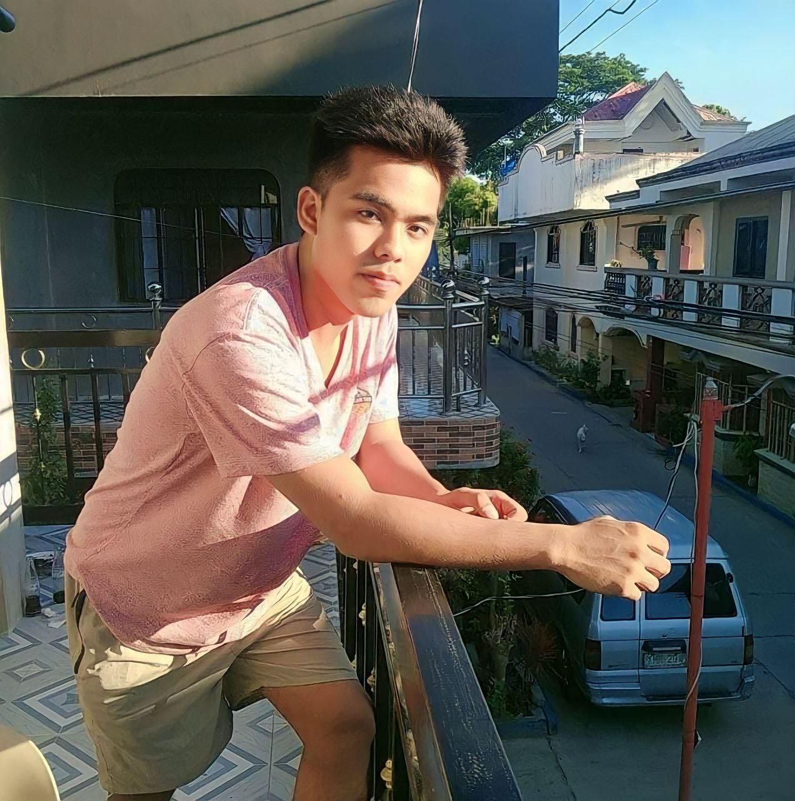

# 🌐 Personal Portfolio Website

This is my **personal portfolio website** built with HTML, CSS, and JavaScript.  
It showcases my skills, projects, certificates, and contact information.

---

## 🚀 Features
- **Responsive Design** – Works on desktop, tablet, and mobile.
- **Home Section** – Introduction and download link for my CV.
- **About Section** – Brief background and skills.
- **Services Section** – Lists the tools and technologies I use.
- **Certificates Section** – Highlights my achievements.
- **Portfolio Section** – Includes my graphic design, websites, and game dev projects.
- **Contact Section** – Simple form for visitors to reach me.
- **Animations** – Powered by [ScrollReveal](https://scrollrevealjs.org/) and [Typed.js](https://mattboldt.com/demos/typed-js/).

---

## 📂 Project Structure
```plaintext
.
├── index.html          # Main entry file
├── style.css           # Main stylesheet
├── breakpoint.css      # Responsive breakpoints
├── main.js             # Custom JavaScript
└── assets/             # Images, CV, and certificates
    ├── image/
    ├── certificates/
    ├── cv/
    └── projects in ojt graphic design/


## ​ Live Demo

👉 **[Visit my portfolio website here](https://rbrtmstrjr.github.io/myportfolio/)**

[](https://rbrtmstrjr.github.io/myportfolio/)

*(Click the image above to open the live site 🚀)*

---

##  Screenshots

###  Home Section


###  Certificates


###  Portfolio Example


